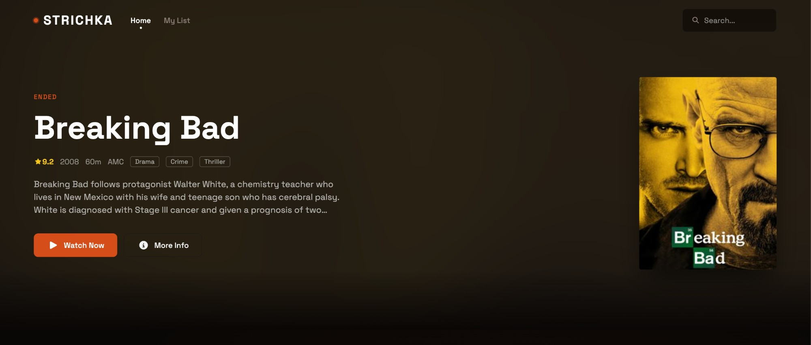
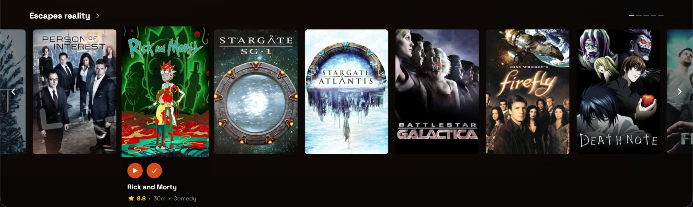
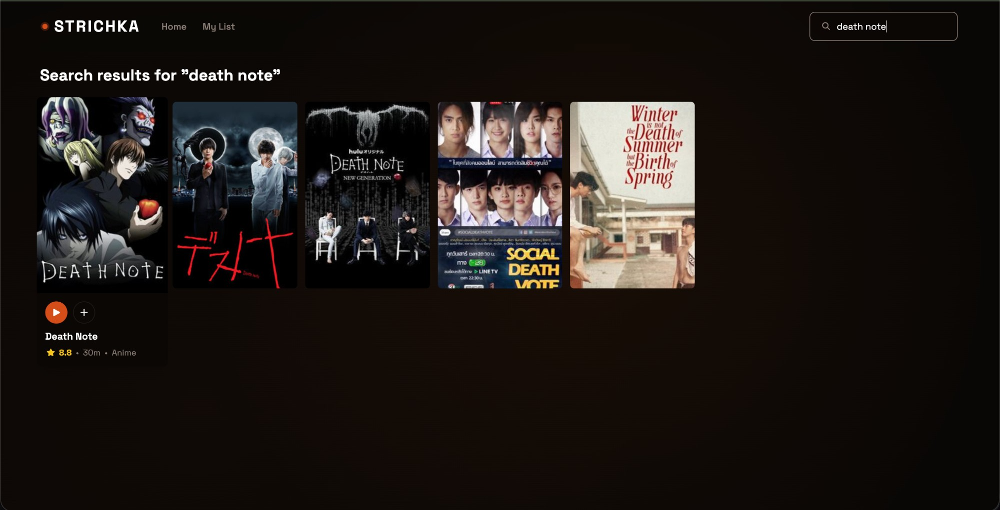
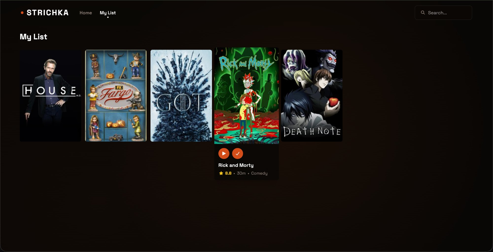
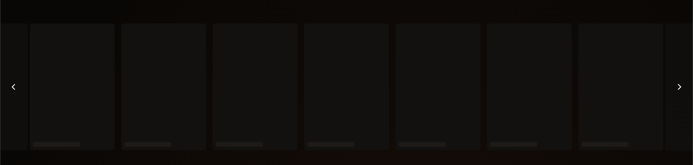

# strichka

> **strichka** (стрічка) — Ukrainian for *tape* or *ribbon*. Like most of my projects, it carries a Ukrainian name — the language has a sound I find beautiful, and it's a small way to bring a piece of my culture along for the ride.

A Netflix-style streaming app built with Vue 3, TypeScript, and Tailwind CSS. Features infinite carousels, genre filtering, search, and a personal watchlist — all powered by the TVMaze API.

---

## Screenshots

**Hero banner**


**Carousel**


**Search**


**My List**


**Skeleton loading**


---

## Requirements

| Tool    | Version  |
|---------|----------|
| Node.js | >= 22    |
| npm     | >= 10    |

---

## Getting Started

```bash
# Copy environment variables
cp .env.example .env

# Install dependencies
npm install

# Start dev server (http://localhost:5173)
npm run dev

# Build for production
npm run build

# Preview production build
npm run preview
```

---

## Testing

### Unit tests (Vitest)

```bash
# Watch mode
npm run test:unit

# Single run
npm run test:unit:run
```

Unit tests live in `tests/unit/`. They cover composable logic (e.g. `useCarousel`).

### E2E tests (Playwright)

```bash
# Run all e2e tests (headless)
npm run test:e2e

# Run with Playwright UI
npm run test:e2e:ui

# Open last HTML report
npm run test:e2e:report
```

> On first run you may need to install browsers: `npx playwright install`

---

## Linting

```bash
# Check for lint errors
npm run lint

# Auto-fix fixable issues
npm run lint:fix
```

---

## Tech Stack

| Layer         | Library / Tool                               |
|---------------|----------------------------------------------|
| Framework     | [Vue 3](https://vuejs.org/) (Composition API, `<script setup>`) |
| Language      | [TypeScript](https://www.typescriptlang.org/) |
| Build tool    | [Vite](https://vite.dev/)                    |
| Styling       | [Tailwind CSS v4](https://tailwindcss.com/)  |
| State         | [Pinia](https://pinia.vuejs.org/)            |
| Routing       | [Vue Router](https://router.vuejs.org/)      |
| E2E tests     | [Playwright](https://playwright.dev/)        |
| Icons         | [Font Awesome 6 Free](https://fontawesome.com/) (solid, regular, brands) |
| i18n          | [vue-i18n v11](https://vue-i18n.intlify.dev/) |
| Linting       | [ESLint](https://eslint.org/) + typescript-eslint + eslint-plugin-vue |
| Git hooks     | [Husky](https://typicode.github.io/husky/) + [lint-staged](https://github.com/lint-staged/lint-staged) |
| Variants      | [tailwind-variants](https://www.tailwind-variants.org/) |
| Utilities     | [VueUse](https://vueuse.org/) |
| Unit tests    | [Vitest](https://vitest.dev/) + [happy-dom](https://github.com/nicedoc/happy-dom) |
| API           | [TVMaze](http://www.tvmaze.com/api) (public, no auth) |

---

## Design System

The app uses a warm, cinematic color palette with custom typography:

### Typography

| Usage    | Font                                                                 |
|----------|----------------------------------------------------------------------|
| Headings | [Oswald Variable](https://fonts.google.com/specimen/Oswald) — bold, condensed, uppercase |
| Body     | [Space Grotesk Variable](https://fonts.google.com/specimen/Space+Grotesk) — geometric, modern |

Fonts are self-hosted via `@fontsource-variable` (no external CDN).

### Colors

| Token              | Value     | Usage                        |
|--------------------|-----------|------------------------------|
| `surface`          | `#0a0705` | Main background              |
| `surface-elevated` | `#141110` | Cards, dropdowns             |
| `surface-hover`    | `#1e1a17` | Hover states                 |
| `muted`            | `#8b7d75` | Secondary text               |
| `accent`           | `#d44d18` | Primary buttons, brand       |
| `accent-hover`     | `#e05a25` | Button hover                 |
| `accent-active`    | `#b84115` | Button pressed               |
| `rating`           | `#f5c518` | Star ratings (IMDb yellow)   |

### Fluid Typography

Text sizes scale responsively using CSS `clamp()`. Defined in `src/styles/main.css` via Tailwind v4 `@theme`.

---

## CI/CD

GitHub Actions runs on every PR and push to `main`:

| Job          | Command                 | Purpose                    |
|--------------|-------------------------|----------------------------|
| **Lint**     | `npm run lint`          | ESLint checks              |
| **Type Check** | `npx vue-tsc -b`      | TypeScript validation      |
| **Unit Tests** | `npm run test:unit:run` | Vitest unit tests        |
| **E2E Tests** | `npm run test:e2e`     | Playwright browser tests   |

All jobs run in parallel for fast feedback. E2E test reports are uploaded as artifacts on failure.

---

## Project Structure

```
src/
  api/
    http.ts              → Base fetch wrapper (BASE_URL from .env)
    shows.ts             → TVMaze show endpoint functions
  assets/                → Static assets (images, fonts, etc.)
  components/
    ui/                  → Presentational/dumb components (props in, events out — no store/API access)
    (root)               → Smart components that compose ui/ with stores/composables
  composables/           → Reusable composition functions (use*)
  router/
    index.ts             → Route definitions
    middleware/          → Route guards (authGuard, guestGuard, etc.)
  stores/
    shows.ts             → Shows store (search, cache)
  styles/
    main.css             → Global CSS entry (Tailwind import)
  types/
    show.ts              → App-internal Show interface
    tvmaze.ts            → Raw TVMaze API response types
  utils/                 → Utility helpers (Sentry, analytics, etc.)
  views/                 → Route-level page components (one per route)
  locales/
    en.json              → English translation strings
  App.vue
  i18n.ts                → vue-i18n setup (locale, fallback, messages)
  main.ts

tests/
  e2e/                   → Playwright end-to-end tests
```

### Component conventions

- `src/components/ui/` — dumb/presentational components. They receive data via props and emit events. No direct store access or API calls.
- `src/components/` (root) — smart components. They wire up `ui/` components with stores and composables.
- `src/views/` — one component per route, mounted by Vue Router.

---

## Architecture Rules

1. **`components/ui/` must be presentational only.** No imports from `stores/`, `api/`, or `composables/`. Props in, events out.

2. **`views/` are route-level containers.** Each view maps 1:1 to a route. They compose components and connect them to stores/composables.

3. **Smart components in `components/` (root) can use stores and composables.** They wire up `ui/` components with application logic.

4. **No direct `api/` imports in components or views.** Always go through a composable or store. Components and views must never call API functions directly.

5. **No barrel exports.** Import directly from the file: `@/components/ui/ValidatedTextInput.vue`, not from an `index.ts` re-export.

---

## Icons (Font Awesome)

All three free icon sets are registered globally — use `<FontAwesomeIcon>` anywhere without importing per component.

```vue
<!-- solid (fas) -->
<FontAwesomeIcon icon="fa-solid fa-house" />

<!-- regular (far) -->
<FontAwesomeIcon icon="fa-regular fa-bell" />

<!-- brands (fab) -->
<FontAwesomeIcon icon="fa-brands fa-github" />
```

Browse available icons at [fontawesome.com/icons](https://fontawesome.com/icons?m=free).

---

## Path Alias

`@` resolves to `src/`. Use it in imports:

```ts
import { useAuthStore } from '@/stores/auth'
import MyButton from '@/components/ui/MyButton.vue'
```

---

## License

[MIT](LICENSE)
